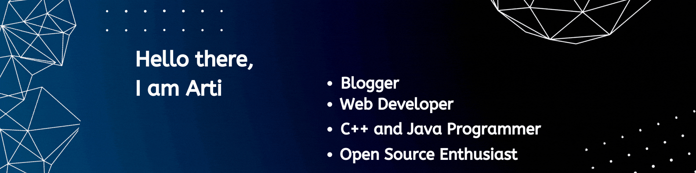

  

<h3 align="center">A girl exploring the stuffs!!!</h3>

  

- 🏫 I,m in sophomore year pursuing Bachelors in Computer Science & Engineering 
- 🌱 I’m currently learning **Data Structures and Algorithms with Java**

- 📝 I regularly write articles on (https://terminalstack.com)

- 💬 Ask me about **Resources for learning Web Development , Roadmap**

- 📫 How to reach me **aartimanputra20@gmail.com**

- ⚡ Fun fact **I think I am Funny XD**

<h3 align="left">Connect with me:</h3>

<h3 align="left">Languages and Tools:</h3>

         

### My Latest Blog Posts 🌱
<!-- BLOG-POST-LIST:START -->
- [Awesome GitHub Repositories which will help you in 2022](https://terminalstack.com/awesome-github-repositories-which-will-help-you-in-2022/)
- [5 best Online courses for students – every student must do](https://terminalstack.com/5-best-online-courses-for-students-every-student-must-do/)
- [Best Roadmap of competitive Programming in 2022](https://terminalstack.com/best-roadmap-of-competitive-programming-in-2021/)
- [Which one is a better framework for CSS -Tailwind CSS or Bootstrap](https://terminalstack.com/which-one-is-better-tailwind-css-or-bootstrap/)
- [The Complete Roadmap To Web Development in 2022](https://terminalstack.com/the-complete-roadmap-to-web-development-in-2022/)
<!-- BLOG-POST-LIST:END -->
➡️ [more blog posts...](https://terminalstack.com/)
</td>
<td valign="top" width="50%">

  
  

<h3 align="center">Show some &nbsp;❤️&nbsp; by starring some of the repositories!</h3>

 
