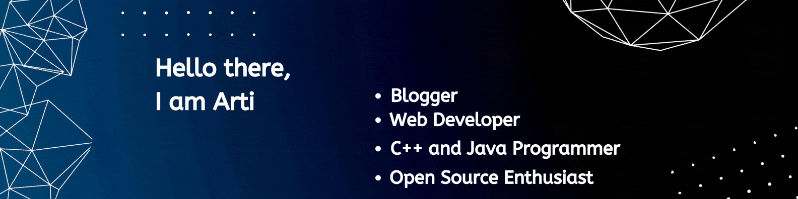

  

<h1 align="center">Hi 👋, I'm Arti</h1>
<h3 align="center">🚀 Building scalable products | Sharing my journey in tech</h3>

  
  
  

### 👩‍💻 About Me

- 👩‍💻 Senior Software Engineer at NeuralGarage  
- 🚀 I love building scalable web applications & clean architectures  
- 🌱 Exploring Python, Cloud, and building with AI  
- 💡 Ex-Senior Software Engineer @TCE | Ex-GDSC Lead @ GCOEA | Beta MLSA 
- ✍️ Writing tech blogs on Medium  
- 📍 Bengaluru, Karnataka, India  

<h3 align="left">Connect with me:</h3>

<table>
  <tr>
    <td></td>
    <td></td>
    <td></td>
  </tr>
</table>

<h3 align="left">Languages and Tools:</h3>

<table>
  <!-- Row 1 -->
  <tr>
    <td></td>
    <td></td>
    <td></td>
    <td></td>
    <td></td>
    <td></td>
    <td></td>
    <td></td>
  </tr>

  <!-- Row 2 -->
  <tr>
    <td></td>
    <td></td>
    <td></td>
    <td></td>
    <td></td>
    <td></td>
    <td></td>
    <td></td>
  </tr>

  <!-- Row 3 -->
  <tr>
    <td></td>
    <td></td>
    <td></td>
    <td></td>
  </tr>
</table>

### My Latest Blog Posts 🌱
<!-- BLOG-POST-LIST:START -->
- [Collection of Open Source Events and Hackathons you need to know](https://medium.com/@aartimanputra20/collection-of-open-source-events-and-hackathons-you-need-to-know-3115b0a23d5b)
- [Best Roadmap of competitive Programming in 2022](https://medium.com/@aartimanputra20/roadmap-of-competitive-programming-1e6354561b53)
<!-- BLOG-POST-LIST:END -->
➡️ [more blog posts...](https://medium.com/@aartimanputra20)
</td>
<td valign="top" width="50%">

  
  

<h3 align="center">Show some &nbsp;❤️&nbsp; by starring some of the repositories!</h3>

 
